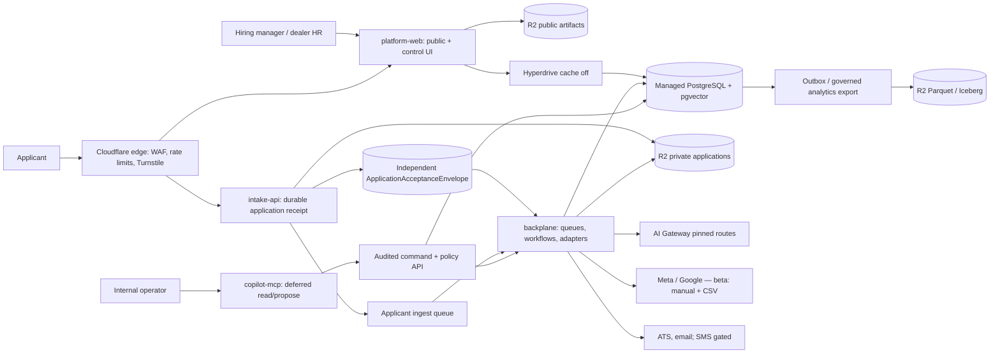

# System map

Authoritative conceptual control/evidence model and deployable topology for DealerHire. Derived from the reconciled architecture (2026-07-28). Future revisions must preserve: one owner and authoritative record per node; actor/authority; claim class; purpose plane; sync vs async boundary; failure/recovery path; liveness contract; at-use disclosure; whether slow evidence can affect only future releases.

## Mission (orientation, not setpoint)

Better labor intelligence and hiring outcomes. Each `JobControlVersion` carries separate measurable references (openings, target start, pay band, budget, response target, yield, time-to-fill, optional Y90). There is **no** universal optimization score.

## Deployables



| Deployable | Runtime | Sync path | Async path |
| --- | --- | --- | --- |
| `platform-web` | OpenNext on Workers | Public: `PageRelease` → R2; Auth: Hyperdrive → Postgres | Triggers commands / imports via APIs |
| `intake-api` | Native Worker | Envelope conditional insert → receipt | Non-gating queue; resume R2 |
| `backplane` | Native Worker | — | Queues, Workflows, webhooks, adapters |
| `copilot-mcp` | Deferred | Signed context → command API | None (stateless) |

## Control and evidence sequence

```text
Job / control references
        ↓
Recommendation (or abstention)
        ↓
Employer authority or standing AutomationPolicy
        ↓
Deterministic arbiter + Command ledger + outbox
        ↓
Execution (beta: human/CSV; later: gated actuators)
        ↓
ActuationReceipt (or NeedsReconciliation)
        ↓
Observation / admission / reconciliation
```

| Node | Authoritative record | Actor / authority | Claim class |
| --- | --- | --- | --- |
| Job/control refs | `JobControlVersion`, `ListingRevision`, `RequirementVersion` | Dealer HR / hiring owner | Rule / descriptive |
| Recommendation | Versioned `Recommendation` | Platform advisory; may abstain | Operational / descriptive |
| Employer authority | Approval + effect manifest, or `AutomationPolicy` | Dealer (deployer); operator only under delegation | — |
| Arbiter / command | `Command`, outbox | Platform deterministic ledger | — |
| Actuation | `ActuationReceipt` | Provider + reconciliation | Evidence for causal only if confirmed |
| Observation | Admitted observations (no raw PII in trail) | Sensors / imports / milestones | Operational / descriptive |

## Purpose planes

| Plane | Examples | Cross-plane rule |
| --- | --- | --- |
| Hiring operations | Requisitions, listings, hiring cases, ATS | Default-deny projections |
| Subject / permission | Notices, permissions, privacy requests, encrypted identity | Recheck authority at every use |
| Publication / disclosure | `PageRelease`, creatives, channel releases | Content-addressed + pointer switch |
| Platform control | Policy packs, audits, commands, release registry | Operator-scoped; forced RLS |

## Bounded contexts (modules as needed)

Organization & access · Labor demand & listings · Intelligence & governance · Publication & brand · Campaign operations · Applicant / subject rights · Hiring & integrations · Measurement & release.

## Beta envelope (live release)

| Dimension | Constraint |
| --- | --- |
| Customer | One NY dealer group + one rooftop |
| Locale / host | English; managed platform subdomain |
| Roles | Every dealership role family deeply validated before beta |
| Candidate AI | Shadow-only |
| Ads | Manual Meta/Google + CSV; no live API actuation |
| Comms | Transactional email; SMS gated |
| Analytics | Tenant-local operational/descriptive; no cross-tenant first-party |
| Support | Business hours + kill switches |

## Failure modes (summary)

| Failure | Behavior |
| --- | --- |
| R2 / scanner down | Accept structured app via envelope; resume `PendingUpload` / `Quarantined` |
| Queue down | Receipt still valid; replay from envelope |
| Postgres control plane down | Public pages via `PageRelease`; auth degraded |
| Stale analytical evidence | Abstain from new advice |
| Stale safety-critical state | Pause active execution |
| Ambiguous provider create | `NeedsReconciliation`; no blind retry |

See [recovery-criteria.md](./recovery-criteria.md) and [ADR 0010](./adr/0010-deployment-observability-rollback.md).
